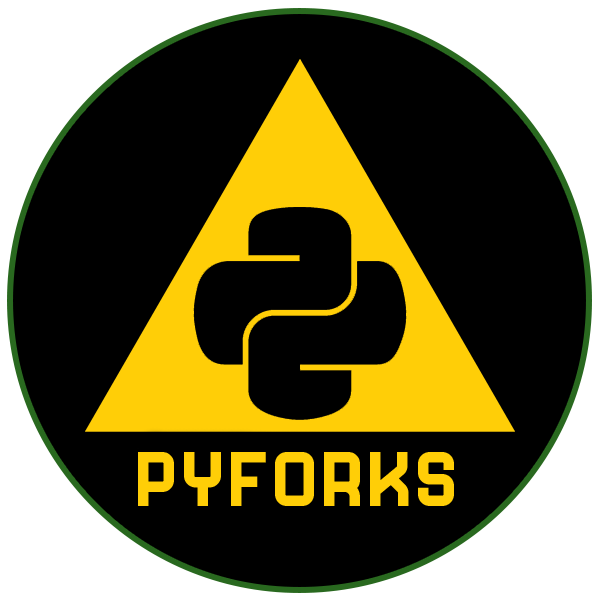

<a href ="https://mn-mtb.com">
  
    </a>


# PyForks

[](https://github.com/cribdragg3r/PyForks/actions/workflows/python-app.yml)
[](https://github.com/cribdragg3r/PyForks/blob/main/LICENSE)
[](https://pypi.org/project/PyForks/)
[](https://codecov.io/gh/cribdragg3r/PyForks)


Python TrailForks Library (Unofficial) for interacting with [TrailForks](Trailforks.com). Help [support](https://github.com/sponsors/cribdragg3r) this project and more.

## About

PyForks has been designed to help me automate much of the manual data aggregation I was doing in order to build metrics for my local city and state trail systems. For example: [app.mn-mtb.com](https://app.mn-mtb.com). The end goal of this project is the ability to make it much easier to pull data down that people are interested in and analyze it in a way that non-technical individuals can digest and understand impact in hopes of additional funding and interest. 

This package uses the [Official TrailForks API](https://www.trailforks.com/about/api). This means that in order to use this package, you must have a valid TrailForks `app_id` and `app_secret`. See the API link to get your keys.

## Installation & Documentation

- Install: `pip install pyforks`
- Documentation: [PyForks.mn-mtb.com](https://PyForks.mn-mtb.com)

### Quick Start

**Get Information on a region**

```python
from PyForks import Region
import pandas as pd

app_id = "id"
app_secret = "secret"

r = Region(app_id=app_id, app_secret=app_secret)
if r.is_valid_region("west-lake-marion-park"):
  region_info_df = r.get_region_info("west-lake-marion-park")
  ridecount_df = r.get_region_ridecounts("west-lake-marion-park")
  
```
## Contribute

Send all the pull requests you want!
